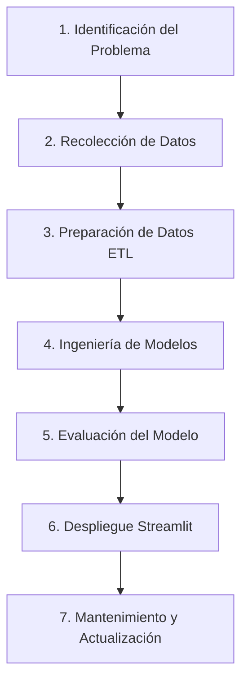

# AgroCrédito Colombia 🌱: Simulación de Préstamos para el Campo Colombiano

[](https://www.python.org/)
[](https://streamlit.io/)
[](https://scikit-learn.org/)
[](https://en.wikipedia.org/wiki/Cross-industry_standard_process_for_data_mining)
[](https://www.finagro.com.co/)

**AgroCrédito Colombia** es un proyecto de Machine Learning de finanzas rurales que aplica de manera completa y rigurosa el **Ciclo de Vida de Machine Learning** y la metodología **CRISP-ML** para optimizar la tasación y simulación de préstamos en el sector agropecuario colombiano.

El modelo de **Regresión Lineal Múltiple** predice la **Tasa de Interés Efectiva Anual (E.A. %)** personalizada para productores rurales, aislando de forma científica los impactos positivos de las políticas estatales de fomento: la Línea Especial de Crédito con subsidio Finagro (LEC) y el respaldo del Fondo Agropecuario de Garantías (FAG).

---

## 🧭 Metodología: CRISP-ML y Ciclo de Vida del ML



### 1. Identificación del Problema (Business Understanding)
Los agricultores colombianos enfrentan dificultades para acceder a créditos transparentes que reflejen su mitigación del riesgo gracias a la experiencia técnica, subsidios estatales LEC y fondos FAG. AgroCrédito proporciona un simulador transparente que automatiza la tasación justa de intereses.

### 2. Recolección de Datos (Data Understanding)
Estructuración de una base de datos histórica y realista de créditos rurales (`data/prestamos_campo.csv`) con 1,000 registros residenciales y variables clave del sector rural, con imperfecciones inducidas (nulos).

### 3. Preparación de Datos (ETL & Data Preparation)
Desarrollado en el cuaderno **`01_ETL_Preparation.ipynb`**:
- Imputación de nulos en `Experiencia_Anios` mediante la **mediana** para contrarrestar atípicos.
- Imputación de nulos en `Garantia_Respaldada` mediante la **moda** (aval o codeudor).
- Casteo de datos numéricos a enteros y float óptimos para el modelado.
- Exportación del conjunto limpio a `data/prestamos_campo_limpio.csv`.

### 4. Análisis Exploratorio de Datos (EDA)
Desarrollado en el cuaderno **`02_EDA_Exploration.ipynb`**:
- Análisis estadístico univariado (tasa de interés) e histogramas de dispersión.
- Visualización de la fuerte reducción en las tasas inducida por el subsidio Finagro LEC (r = -0.73) y garantías FAG (r = -0.42).
- Heatmap de correlaciones de Pearson, descartando colinealidad.

### 5. Ingeniería de Modelos (Modeling)
Desarrollado en el cuaderno **`03_Model_Evaluation.ipynb`**:
- Partición 80% entrenamiento / 20% prueba con semilla de control fija.
- Ajuste del estimador de **Regresión Lineal Múltiple**.
- Extracción de coeficientes físicos explicativos (variación exacta de tasa en puntos porcentuales).

### 6. Evaluación del Modelo (Evaluation)
- Excelente ajuste del modelo con un **$R^2$ de 98.42%** y un **MAE de solo ~0.65 puntos porcentuales de tasa (E.A. %)**.
- Validación de homocedasticidad y normalidad de residuos estadísticos.

### 7. Despliegue (Deployment)
- Serialización del modelo con joblib a `modelo_prestamos.pkl`.
- Salpicadero web interactivo con **Streamlit (`app.py`)** que predice tasas, genera tablas de amortización detalladas mes a mes y compara diferentes tipos de créditos rurales con gráficos interactivos.
- **Landing Page Premium (`index.html`)** que incorpora un simulador interactivo programado en JavaScript para simulaciones estáticas rápidas.

---

## 📁 Arquitectura del Repositorio

El proyecto cuenta con la siguiente estructura limpia de archivos:

```text
proyecto_ml_crisp/
├── data/
│   ├── prestamos_campo.csv               # Dataset original de préstamos agrícolas
│   └── prestamos_campo_limpio.csv        # Dataset resultante del pipeline ETL
├── 01_ETL_Preparation.ipynb              # ETL y Limpieza de datos (Jupyter Notebook)
├── 02_EDA_Exploration.ipynb              # Análisis Exploratorio de Datos (Jupyter Notebook)
├── 03_Model_Evaluation.ipynb             # Modelado, Coeficientes y Evaluación (Jupyter Notebook)
├── app.py                                # Aplicación web de Streamlit para el simulador
├── model_utils.py                        # Función predictiva reutilizable
├── index.html                            # Landing page corporativa premium
├── requirements.txt                      # Dependencias de Python
└── README.md                             # Documentación técnica
```

---

## 🛠️ Instalación y Ejecución Local

1.  **Navegar al directorio del proyecto:**
    ```bash
    cd proyecto_ml_crisp
    ```
2.  **Instalar dependencias:**
    ```bash
    pip install -r requirements.txt
    ```
3.  **Ejecutar el pipeline de datos (opcional):**
    ```bash
    python generate_data.py
    python run_etl.py
    python run_modeling.py
    ```
4.  **Iniciar la aplicación Streamlit:**
    ```bash
    streamlit run app.py
    ```
    *Se desplegará una pestaña local en `http://localhost:8501`.*

---

## 👩‍🌾 Impacto Neto en la Tasa E.A. % (Coeficientes de la IA)
*   **Subsidio LEC Finagro:** Disminuye en promedio **-5.50% E.A.** la tasa de interés.
*   **Garantía Respaldo FAG:** Disminuye en promedio **-3.20% E.A.** la tasa.
*   **Experiencia Técnica (por año):** Disminuye **-0.06% E.A.** por cada año laborado en el agro.
*   **Ingresos Mensuales:** Disminuye **-0.30% E.A.** por cada Millón de COP de ingresos.
*   **Plazo de Amortización:** Incrementa **+0.03% E.A.** por cada mes contratado.

---
*Proyecto educativo de ingeniería de datos y despliegue científico de finanzas rurales. Licencia MIT.*
